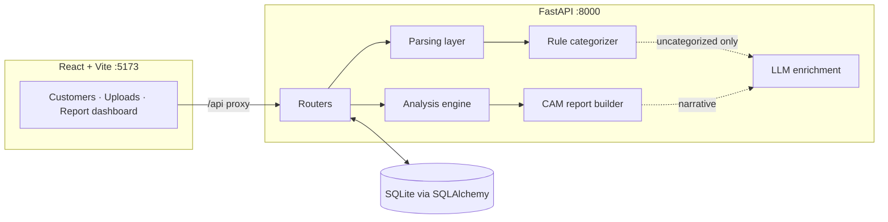

# CrediSight — Architecture & Design

## Design principles

1. **Deterministic first, LLM second.** Every number a credit decision rests on
   (balances, EMIs, bounces, FOIR) comes from auditable rule-based computation.
   The LLM is used only where rules genuinely fall short: classifying opaque
   narrations the regex engine couldn't, and drafting the analyst narrative.
   Every LLM output is labeled (`category_source: llm`, `narrative_source: llm`)
   and the system degrades gracefully to rules-only when no key is configured.

2. **Layered parsing for messy real-world inputs.** Bank statements vary wildly.
   Parsing is a pipeline of strategies, most-reliable first, with per-file
   status (`parsed / partial / failed`) and human-readable notes surfaced in
   the UI rather than silent failures.

3. **Analysis as pure functions.** `services/analysis.py` operates on a
   detached `Txn` dataclass — no ORM, no I/O — so every module is unit-testable
   and the whole report is reproducible from stored transactions.

## System diagram



## Data model

```
Customer 1─* Account 1─* Statement 1─* Transaction
Customer 1─* Loan          (declared obligations)
Customer 1─* Analysis      (immutable snapshot of each report run, stored as JSON)
```

Storing each analysis run as a JSON snapshot gives full audit history: a
report never changes retroactively when new statements are uploaded.

## Parsing layer (`services/parsing/`)

**PDF (`pdf_parser.py`)** — three strategies in order:
1. `pdfplumber` table extraction with the *lines* strategy (bordered tables)
2. table extraction with the *text* strategy (borderless layouts)
3. regex over raw text lines (`date … narration … amounts`) with credit/debit
   inference from Cr/Dr suffixes and keywords — flagged in parse notes so the
   analyst knows direction was inferred

**Excel/CSV (`excel_parser.py`)** — reads every sheet with no schema
assumption; CSVs are read with the `csv` module (delimiter-sniffed, multiple
encodings) because bank CSVs start with metadata lines that break
schema-inferring readers.

**Normalizer (`normalizer.py`)** — the shared brain:
- Header detection anywhere in the first 30 rows, fuzzy-matched against ~50
  known header variants ("Txn Date", "Narration", "Withdrawal Amt", "Dr/Cr", …)
- Supports separate debit/credit columns, single signed amount columns, and
  amount+Dr/Cr-indicator layouts
- Amount parsing for Indian/international formats: `1,23,456.78`, `(500)`,
  `500 Cr`, currency symbols
- Date parsing: day-first and month-first, `dd-MMM-yy`, ISO, Excel serials
- Skips repeated page headers, summary/total rows; merges wrapped narration
  continuation lines into the previous transaction
- Positional fallback: if no header row exists, columns are inferred by
  scoring cell content (dates vs numbers vs text)

## Rule categorizer (`services/categorization.py`)

Ordered regex rules (first match wins) tuned for Indian + international
narration styles, covering: salary, EMI (incl. ~15 NBFC name stems), cheque
and ECS/NACH bounces, penalty/return charges, cash deposit/withdrawal, cards,
investments, insurance, rent, utilities, tax, refunds, bank charges, gambling,
crypto, UPI/NEFT/RTGS/IMPS transfers. Order matters and is deliberate
(e.g. penalty-charge before ecs-bounce so "ECS RTN CHGS" is a charge, not a
bounce). Also extracts the **channel** (upi/neft/ach/cheque/atm/…) and a
best-effort **counterparty** from the narration.

## Analysis engine (`services/analysis.py`)

| Module | Method |
|---|---|
| Monthly analysis | Group by `YYYY-MM`; totals, counts, net flow |
| Average balance | End-of-day balance series carried forward across gap days; uses the statement's running balance column when present, else reconstructs from flows; multi-account series are summed day-wise |
| Income tracking | Salary-keyword credits grouped by counterparty/description signature (reference numbers stripped) + amount proximity; plus recurring non-keyword credits with monthly cadence (24–38 day gaps) for the self-employed |
| EMI detection | Recurring-debit clustering with 10% amount tolerance and cadence check; median amount per lender group |
| Bounce detection | Category-based (cheque vs ECS/NACH) with month-wise distribution; penalty charges summed separately |
| Unusual transactions | Absolute threshold (config), 3σ z-score outliers per direction, large round-figure cash |
| Patterns | Category/channel aggregation, weekday spend, inflow trend (first-half vs second-half means), volatility (CV), expense-to-income |
| Red flags | Bounces, negative-balance days, cash intensity, income irregularity, gambling/crypto, circular flows (credit ↔ similar debit within 3 days), end-period balance spike (window dressing), month-end depletion, outflow > inflow |
| Repayment capacity | FOIR = obligations / income vs policy cap; obligations = max(detected EMIs, declared EMIs) as a conservative floor; eligible additional EMI headroom; verdict bands |
| Composite score | 100-point transparent breakdown: income regularity 25, bounce record 25, balance health 20, obligation headroom 20, conduct 10 |

## LLM layer (`services/llm.py`)

- `classify_transactions` — batches of ≤60 uncategorized narrations →
  `{id: category}` JSON, constrained to the allowed category list, temperature 0.
- `cam_narrative` — a slimmed report JSON → 180–300-word CAM banking-analysis
  narrative. Prompt forbids inventing numbers and forbids an approve/reject verdict.
- Both wrap every call in try/except; any failure returns rules-only results.
- `template_narrative` — deterministic fallback narrative.

## Scalability path

Current build is a single-node, SQLite-backed app sized for an analyst
workstation or small team. The seams for scaling are already in place:

- **DB**: swap `DATABASE_URL` to Postgres — everything is SQLAlchemy 2.x.
- **Parsing throughput**: parsing is synchronous per upload request; for bulk
  ingestion move `parse_*` calls onto a task queue (Celery/RQ) — they're
  already pure functions taking a file path.
- **Statelessness**: no server-side sessions; the API can run multiple Uvicorn
  workers (`--workers N`) behind a reverse proxy as-is.
- **Frontend**: `npm run build` produces a static bundle servable from any CDN;
  point it at the API host.

## Security notes

- The OpenAI key lives only in `backend/.env` (gitignored) or the environment.
- Uploaded statements are stored under `backend/uploads/` with UUID names.
- Only slimmed, already-computed aggregates plus narration snippets are sent to
  the LLM — never the raw statement files.
- CORS is restricted to the local frontend origins.
